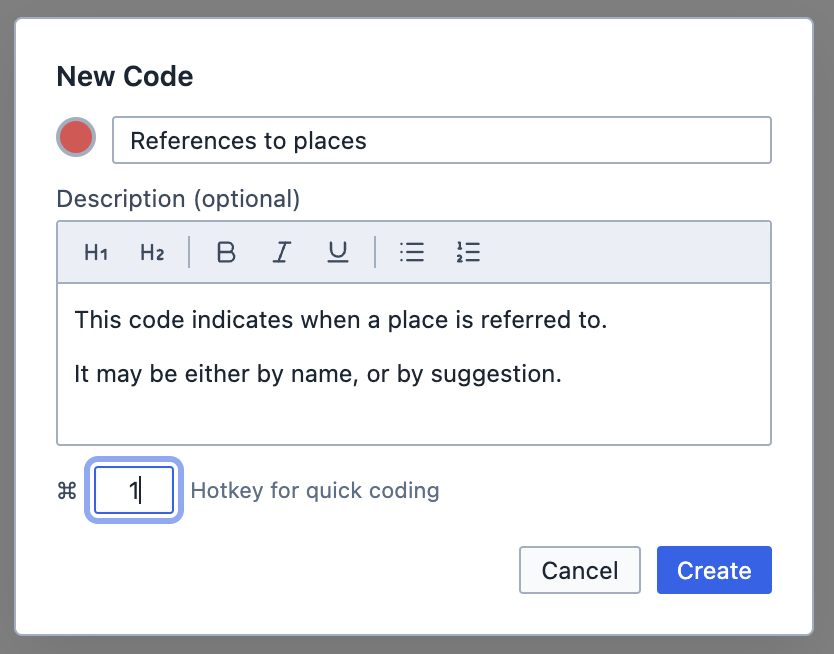
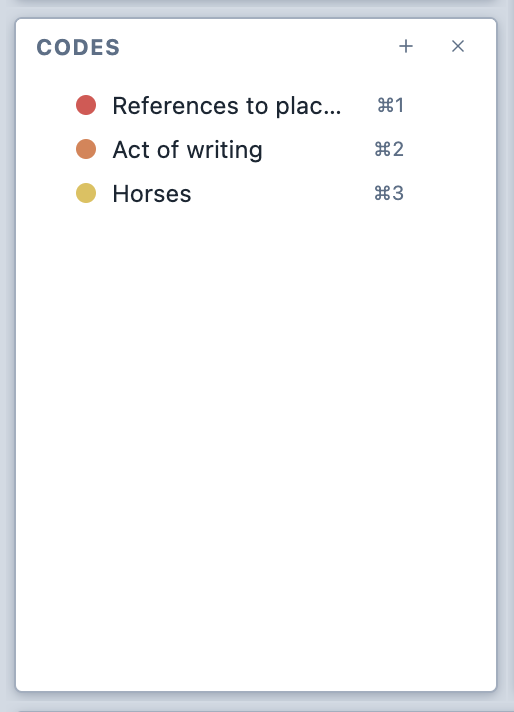
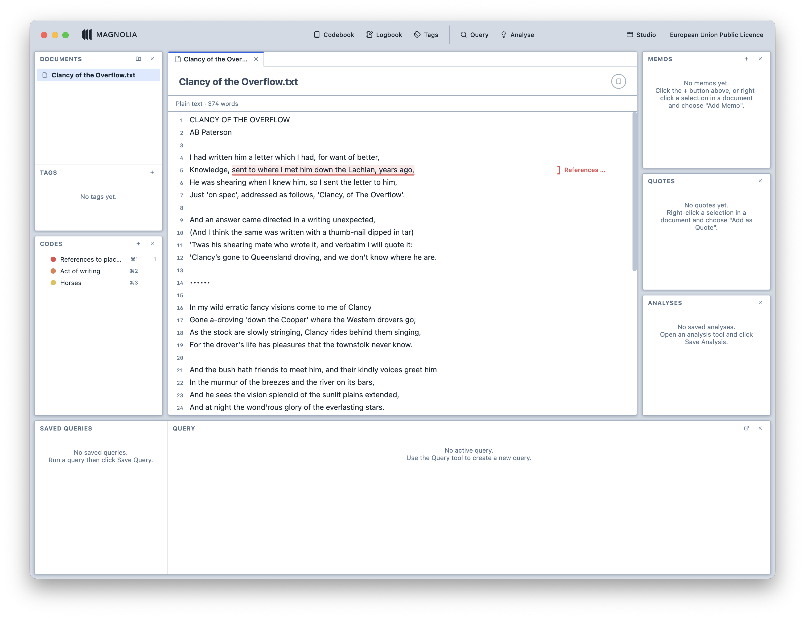
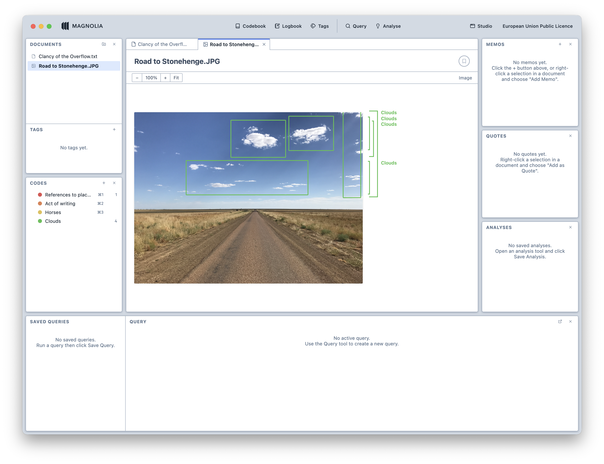
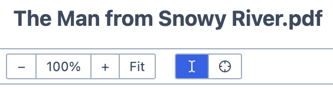
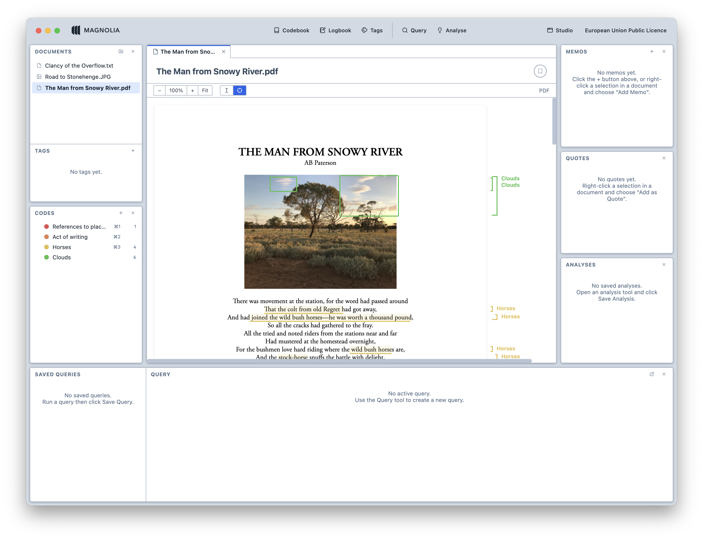

# Coding your data

Coding is the heart of qualitative analysis: you mark passages of your data and
attach a label—a *code*—to them. Think of it as having an infinite supply of
highlighters, where you can name them anything you want. Your desk is not big enough for that, but with Magnolia, it doesn't need to be because coding is done digitally.

## Creating codes

1. Press `+` in the Code Browser, or hit `⌘ + N` .

2. In the popup, enter the name of the code. You can also select a colour, give it a description, or assign a hotkey.

   <figure>
     
     <figcaption>The new code popup.</figcaption>
   </figure>

3. After clicking `Create`, your code appears in the Code Browser. You can create as many codes as you want.

   <figure>
     
     <figcaption>The code browser.</figcaption>
   </figure>

## Coding text

1. Select the text you wish to code in the Viewer. Then:
   1. Drag the code from the Code Browser to the Viewer; or,
   2. Press the hotkey assigned to the code.

2. Your code is assigned to the selection.

   <figure>
     
     <figcaption>Coded text.</figcaption>
   </figure>

3. You can continue to assign codes without having to reselect the text. They will be applied to the previous selection.

## Coding images

1. Click and drag on the image to create a selection. Then:
   1. Drag the code from the Code Browser to the Viewer; or,
   2. Press the hotkey assigned to the code.

2. Your code is assigned to the selection.

   <figure>
     
     <figcaption>A coded image.</figcaption>
   </figure>

3. You can continue to assign codes without having to reselect the selection. They will be applied to the previous selection.

## Coding PDFs with both text and images

1. You can switch between text selection and box selection using the toolbar in the Viewer.

   <figure>
     
     <figcaption>The PDF toolbar.</figcaption>
   </figure>

   <figure>
     
     <figcaption>A PDF containing coded text and images.</figcaption>
   </figure>

::: tip
Knowing how to code text, images, and documents with text an images is all you need to know to apply codes. Every other document type works on the same principles: transcripts and surveys, for example, are just text documents in disguise.
:::
