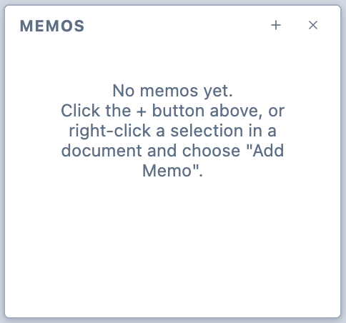
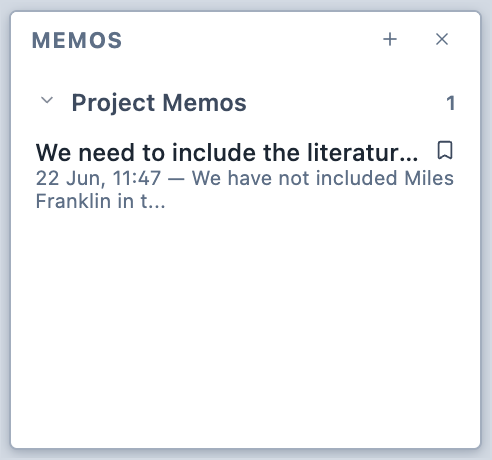
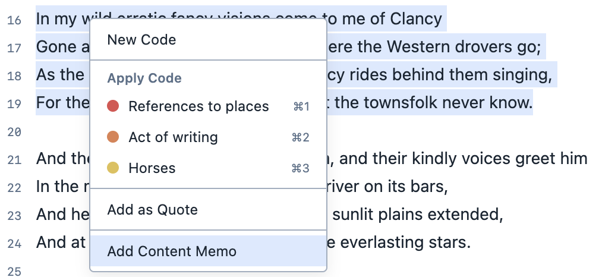

# Creating and deleting memos

The manner in which you create a memo changes depending on what you are attaching it to.

In all cases, memos can either be created by either:

- Clicking the ```+``` button in the Memos Panel
- Right-clicking a selection and choosing ```Add Selection Memo```
- Clicking the Memo button.

::: tip
Only memos attached to the project as a whole are always visible in the Memos panel. All other memos will only show when you have the document, query, or analysis to which they are attached  open in the Viewer. 
:::

## Project memos

Project memos are attached to the project as a whole. They are always visible in the Memos Panel.

**To create a project memo:**

1. Click the ```+``` button in the Memos Panel.

   <figure>
     
     <figcaption>The Memos Panel, with no memos.</figcaption>
   </figure>

2. Choose ```Project Memo```.

3. Your project memo will appear in the Memos Panel. It will be visible regardless of which document is active in the Viewer.

   <figure>
     
     <figcaption>The Memos Panel.</figcaption>
   </figure>

## Selection memos

Selection memos are attached to segments in documents. These can be either selections of text or selections of images.

**To create a selection memo:**

1. Select the text or the part of the image you would like to attach the memo to.

2. Right-click on the selection and choose "Add selection memo".

   <figure>
     
     <figcaption>The contextual menu used to create a selection memo.</figcaption>
   </figure>

3. The memo appears in the Memos Panel.

## All other memos

All other memos are attached to components of a project, such as analyses, documents, questions in surveys, or answers to surveys.

**To create any other memo:**

1. Click the memo button in the toolbar.

   <figure>
     
     <figcaption>The memo button.</figcaption>
   </figure>

2. The memo appears in the Memos Panel. The memo button becomes coloured-in.

## Deleting memos
**To delete a memo:**

1. Right-click the memo in the Memos Panel.

2. Choose ```Delete Memo```.
