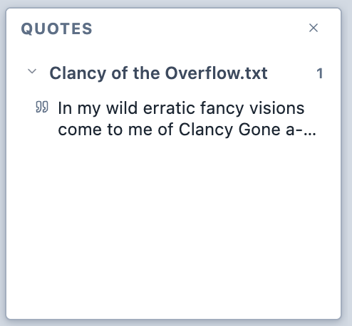
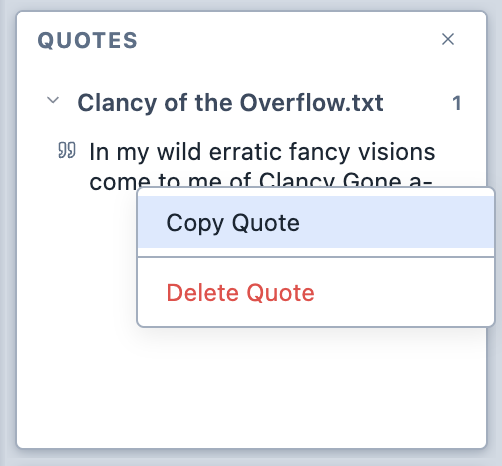

# Creating quotes

To create a quote:

1. Select the text or the part of the image you wish to quote.

2. Right-click on the selection and choose "Add as quote".

   <figure>
     
     <figcaption>Adding a quote.</figcaption>
   </figure>

3. The quote appears in the Quotes Panel.

   <figure>
     
     <figcaption>The Quotes Panel.</figcaption>
   </figure>

4. You can right-click on a quote in the Quotes Panel to copy it to the clipboard or delete it.

   <figure>
     
     <figcaption>The Quotes Panel contextual menu.</figcaption>
   </figure>
