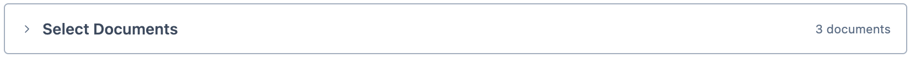

# Document Selector

The Document Selector is a function common to the query tool and several analysis tools. It allows you to select which documents your query or analysis applies to.

## Default state
By default, the Document Selector is collapsed and targets all documents in your project.
<figure>
     
     <figcaption>The Document Selector in its default state.</figcaption>
</figure>

## Inputs
You can select which documents your query or analysis applies to by:
- Documents
- Tags
- Document types (video, audio, image, document, survey)
- Folder

::: tip
You cannot simply drag documents directly from the Document Browser onto the Document Selector canvas. Instead, they must be dropped into a pre-existing Document node box on the canvas.
:::

## Operators
You can add logical operators into your document selection to refine it. Magnolia uses these logical operators:

| Operator | Output |
| --- | --- |
| Union | Selects documents from Input 1 and Input 2 |
| Intersect | Selects documents where both Input 1 and Input 2 are met | 
| Subtract | Selects documents where Input 1 is met but Input 2 is not met | 

::: tip
You can use the output of any logical operator as the input to another logical operator.
:::

<figure>
     
     <figcaption>The Document Selector with a completed selection, targeting "all books by Richard Flanagan".</figcaption>
</figure>

## Selected documents list
For convenience, the Document Selector shows you which documents your selection targets.

::: tip
Remember to connect your selection to the Result node box.
:::