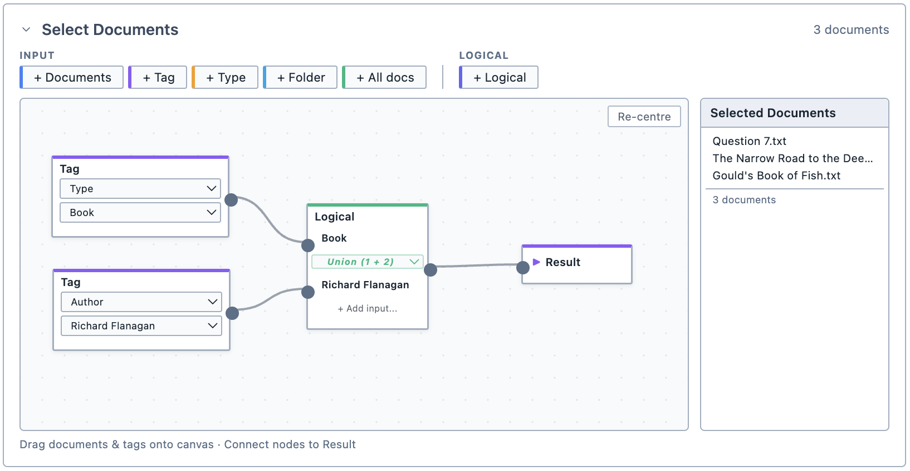

# Grouping

Group By is a function common to several analysis tools. It allows you to conveniently group your results.

## Default state
If the [Document Selector](/guide/documentselector) **does not** target a survey, by default, your results will not be grouped unless you specify otherwise. This means that you will see the results for each individual document.

<figure>
     
     <figcaption>The default state of Group By when the document selector **does not** target a survey.</figcaption>
</figure>

If the [Document Selector](/guide/documentselector) **does** target a survey, by default, your results will be grouped by respondents. This means that you will see the results for each individual document, with all respondents grouped together for the survey (or surveys).

<figure>
     
     <figcaption>The default state of Group By when the document selector **does** target a survey.</figcaption>
</figure>

::: info
The reason for this is simply that if survey results were not grouped by respondent, your results table would consider each respondent's answers to be a document in itself and make a separate column for each survey respondent. The results can then become very long (a survey with 50 respondents, for example, would have a column for each respondent!). If you do want to see each respondent in an individual column, simply remove Respondents from Group By.
:::

If the [Document Selector](/guide/documentselector) **does** target a survey, you will also see a Questions box appear below the Group By box. This allows you to limit your selection to specific questions in the survey. To limit the selection to specific questions in the survey, drag those questions from the Document Browser into the Questions box.

## Inputs
You can select which documents your query or analysis applies to. This can be done by:
- Documents
- Tags
- Document types (video, audio, image, document, survey)
- Folder

::: tip
You cannot simply drag documents directly from the Document Browser onto the Document Selector canvas. Instead, they must be dropped into a pre-existing Document node box on the canvas.
:::

## Operators
You can add logical operators into your document selection to refine it. Magnolia uses these logical operators:

| Operator | Output |
| --- | --- |
| Union | Selects documents from Input 1 and Input 2 |
| Intersect | Selects documents where both Input 1 and Input 2 are met | 
| Subtract | Selects documents where Input 1 is met but Input 2 is not met | 

::: tip
You can use the output of any logical operator as the input to another logical operator.
:::

<figure>
     
     <figcaption>The Document Selector with a completed selection, targeting "all books by Richard Flanagan".</figcaption>
</figure>

## Selected documents list
For convenience, the Document Selector shows you which documents your selection targets.

::: tip
If the Selected Documents list is showing something unexpected, check that the wiring of the boxes on the canvas is correct.
:::