# Querying

Querying data allows you to see all selections coded with particular codes.

## See all selections with a code

1. In the Code Browser, right-click on the code you wish to query.

2. Select either `Show in Active Document` or `Show in All Documents`.

   <figure>
     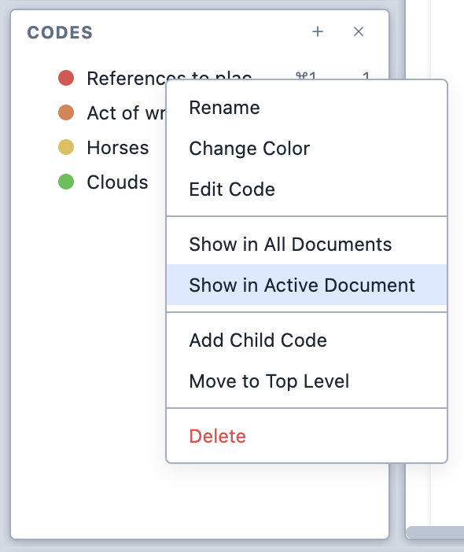
     <figcaption>The contextual menu for the Code Browser.</figcaption>
   </figure>

3. The matching selections are shown in the Query Results pane.

   <figure>
     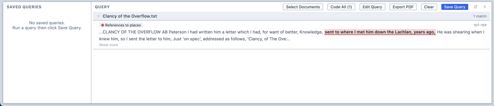
     <figcaption>The Query Results pane.</figcaption>
   </figure>

4. You can save the query to be run later by clicking `Save Query` in the Query Results pane. Magnolia will suggest a name for the query, but you are free to change it.

## The Query Builder

The Query Builder allows you to create complex queries that target specific documents, groups of documents, survey questions, or survey respondents.

To open the Query Builder, click the `Query` button in the toolbar.

The Document Selector is, by default, collapsed. It will apply your query to all documents unless you specify otherwise.

When a new query is created, the Query Builder is empty.

<figure>
  
  <figcaption>The empty query builder, ready for a query to be built.</figcaption>
</figure>

The Query Builder is a visual, node-based editor. Think of it like a pipeline that you can pour different things into.

To create a query:

1. Drag a code from the Code Browser onto the Query Builder's canvas; and,

2. Click and drag on the connection point to connect it to the Results output.

   <figure>
     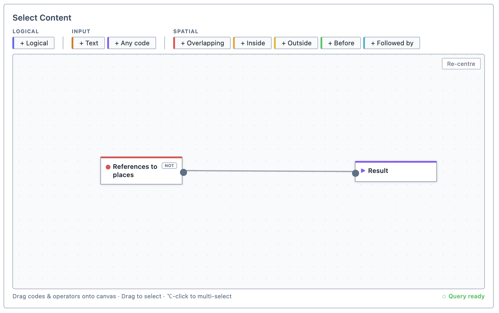
     <figcaption>The query builder with a simple query.</figcaption>
   </figure>

3. Ensure it is connected the Results node.

## Searching for text

1. Drag the text node onto the canvas.

   <figure>
     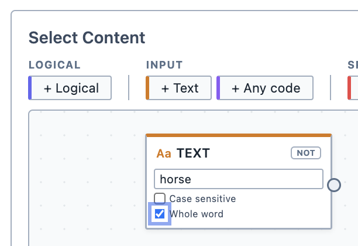
     <figcaption>The text node.</figcaption>
   </figure>

2. Insert the text you wish to search for, whether it is case-sensitive, and whether you are looking for a whole word.

3. Ensure it is connected the Results node.

## Logical operators

You can add logical operators into your query to refine it. Magnolia uses the common boolean logical operators:

| Operator | Output |
| --- | --- |
| AND | Outputs segments where all inputs are met |
| OR | Outputs segments where any of the inputs are met | 
| NOT | Outputs segments that do not match the inputs | 
| XOR | Outputs segments where one, but not more, of the inputs are met | 

To use a logical operator:

1. Drag the logical operator onto the canvas.

   <figure>
     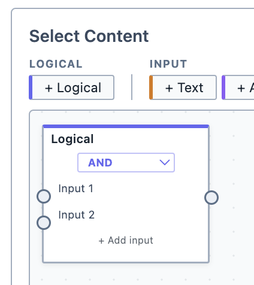
     <figcaption>The logical operator node.</figcaption>
   </figure>

2. Select the type of logical operator you would like to apply from the drop-down list.

3. Wire up the inputs you want the logical operator to take.

4. Ensure it is connected the Results node.

## Spatial operators

You can add spatial operators into your query to refine it. Spatial operators return coded segments based on their position in relation to other coded segments.

| Operator | Output |
| --- | --- |
| Overlapping | Outputs segments where Code 1 and Code 2 overlap |
| Inside | Outputs segments where Code 1 is fully inside by Code 2 | 
| Outside | Outputs segments of Code 1 that do not overlap with Code 2 | 
| Before | Outputs segments of Input 1 where Input 1 ends before Input 2, with no overlap between them | 
| Followed By | Outputs segments of Input 1 where Input 1 starts after Input 2, with no overlap between them | 

<figure>
     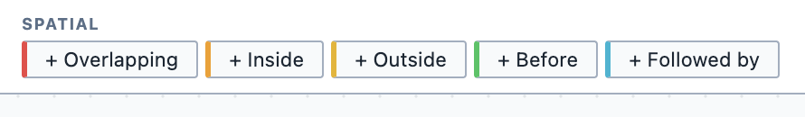
     <figcaption>The spatial operator nodes.</figcaption>
</figure>

## An example

Imagine you have the following segment of coded text.

<figure>
     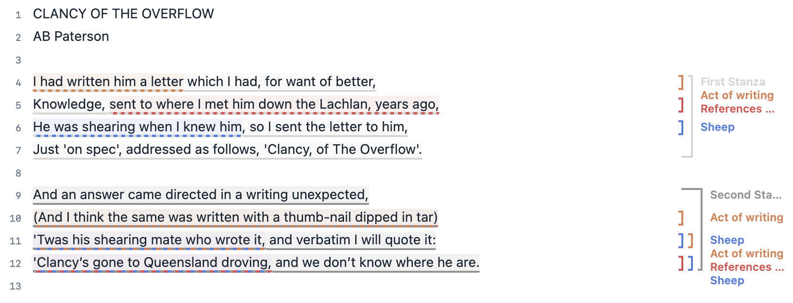
     <figcaption>A segment of text with a lot of codes applied.</figcaption>
</figure>

### And
<figure>
     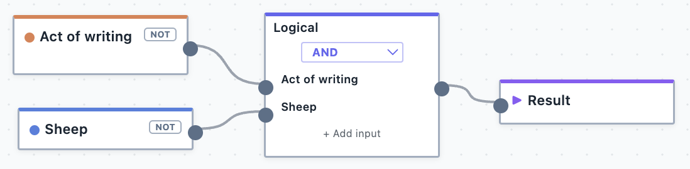
     <figcaption>The AND logical operator.</figcaption>
</figure>
Produces: 

- ``` 'Twas his shearing mate who wrote it```

### Or
<figure>
     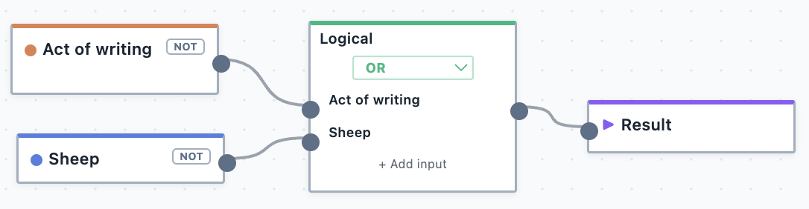
     <figcaption>The OR logical operator.</figcaption>
</figure>
Produces: 

- ``` 'Twas his shearing mate who wrote it```
- ``` I had written him a letter```
- ```(And I think the same was written with a thumb-nail dipped in tar)```
- ``` 'Twas his shearing mate who wrote it```
- ``` Clancy's gone to Queensland droving```

::: info
In this example, ``` 'Twas his shearing mate who wrote it``` is returned twice because it matches both Code 1 and Code 2. It is an act of writing about sheep—fulfilling the great Australian literary tradition of writing about these fluffy creatures.
:::

### Not
<figure>
     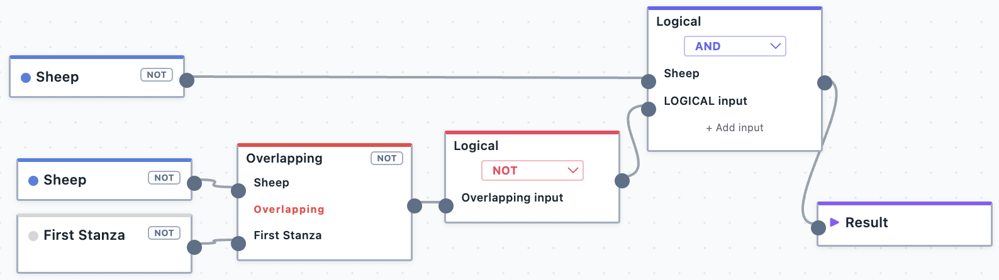
     <figcaption>The NOT logical operator.</figcaption>
</figure>
Produces: 

- ``` 'Twas his shearing mate who wrote it```
- ``` Clancy's gone to Queensland droving```

::: info
Conceptually, the NOT operator is perhaps the most difficult to understand. This is because it just flips whatever is put into it. This can lead to a lot of output, because it effectively asks Magnolia to "show everything that is not coded with whatever I am putting in".  

The example above, while it looks intimidating, is essentially just the same as saying "show me all segments about sheep that are not in the first stanza". You could accomplish this same result in other ways, such as by using the OUTSIDE code. 
:::

### Xor
<figure>
     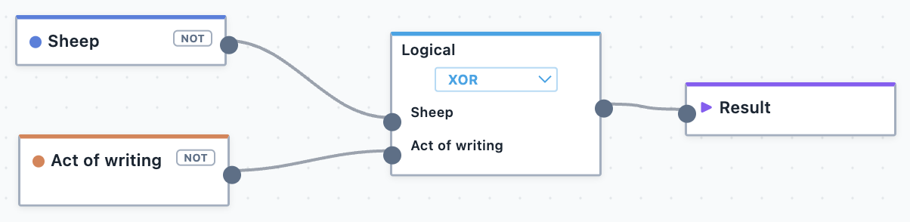
     <figcaption>The XOR logical operator.</figcaption>
</figure>
Produces: 

- ``` He was shearing when I knew him```
- ``` I had written him a letter```
- ```(And I think the same was written with a thumb-nail dipped in tar)```
- ``` Clancy's gone to Queensland droving```

::: info
The Xor logical operator is pronounced "exclusive or". In this example, ``` 'Twas his shearing mate who wrote it``` is not returned because this segment is both an act of writing and about sheep. It therefore meets both conditions, and because of this, it is excluded (it is not exclusively about sheep or an act of writing).
:::

### Overlapping
<figure>
     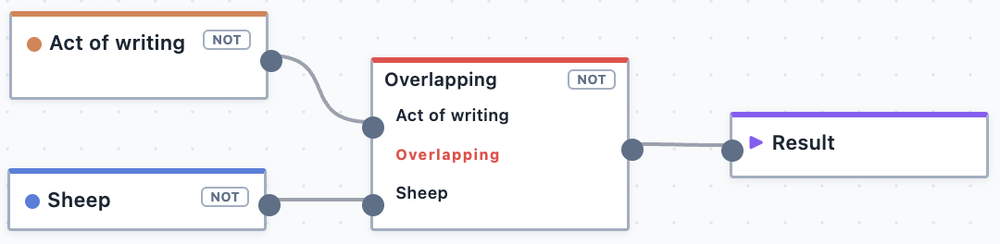
     <figcaption>The overlapping spatial operator.</figcaption>
</figure>
Produces: 

- ``` 'Twas his shearing mate who wrote it```

### Inside
<figure>
     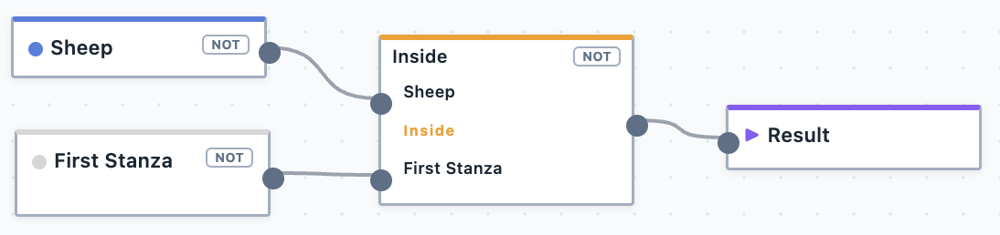
     <figcaption>The inside spatial operator.</figcaption>
</figure>
Produces: 

- ``` He was shearing when I knew him```

### Outside
<figure>
     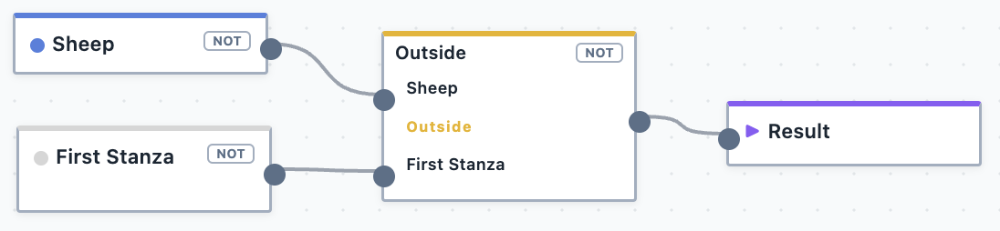
     <figcaption>The outside spatial operator.</figcaption>
</figure>
Produces: 

- ``` 'Twas his shearing mate who wrote it```
- ``` Clancy's gone to Queensland droving```

### Before
<figure>
     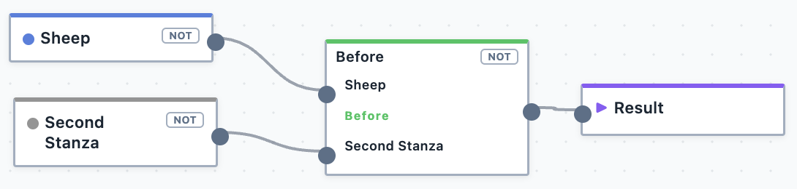
     <figcaption>The before spatial operator.</figcaption>
</figure>
Produces: 

- ``` He was shearing when I knew him```

### Followed By
<figure>
     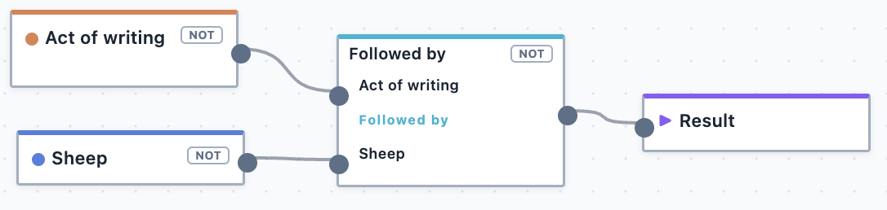
     <figcaption>The followed by spatial operator.</figcaption>
</figure>
Produces: 

- ```(And I think the same was written with a thumb-nail dipped in tar)```

::: info
In this example, ``` 'Twas his shearing mate who wrote it``` is not returned because the two codes overlap on that segment.
:::